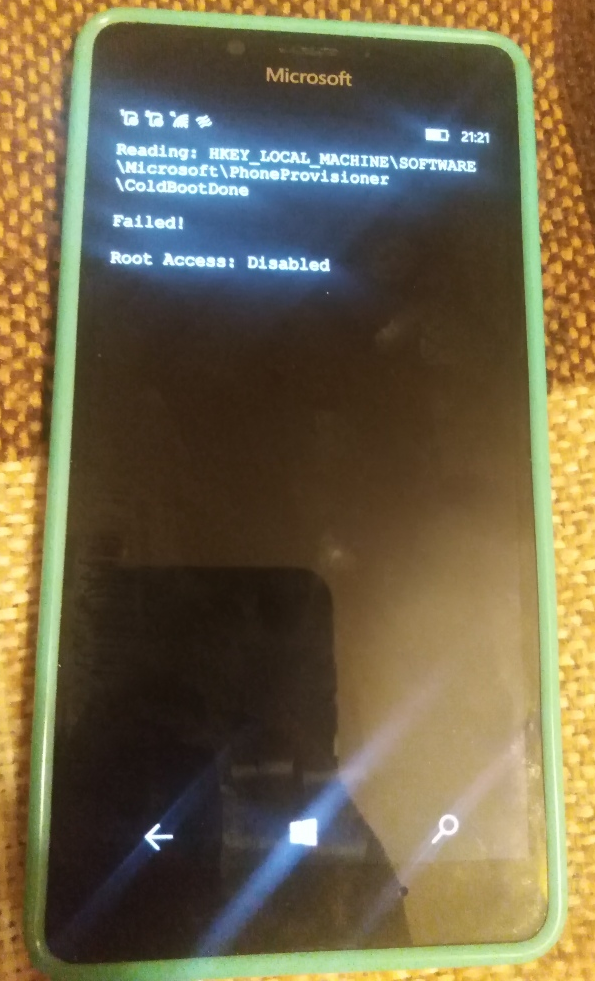

# RootAccessTestUWP
I researched the Rene Lergner's Windows Phone Internals tool (master and dev branches), and found this (funny and userful to me) project 
named RootAccessTestUWP. I re-designed it onto/into RootAccessTestUWP solution (nice logo added... and it all))). 

## The purpose
It only detects the state of locking/unlocking the bootloader (at/in my Lumia 950). 

#Screenshots
<table><tr>
<td>  </td>
</tr></table>

## Mobile Winows sys. reqs
- Req. os. build: 10.0.19041.0 (22000 not tested yet, hehe!)))
- Min. os. build: 10.0.10240.0

## References
- https://github.com/ReneLergner/WPinternals/

## .
AS IS. No support. RnD only. Enjoy the simple(st) system sample. 

# ..
[m][e] 2022
